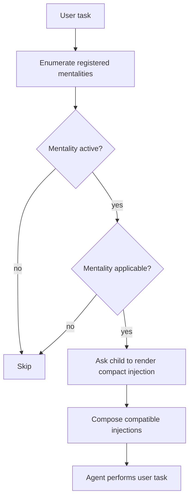

# `imsight-inject-mentality` Design Overview

Status: implemented locally; runtime persistence adapter remains future work.

## Purpose

`imsight-inject-mentality` gives an Imsight agent named, persistent ways of thinking that can be activated and adjusted independently. A mentality changes what the agent habitually notices and remembers while working; it does not replace the user's task, impose a workflow, or grant additional authority.

The first mentality is `brooks`, which teaches the agent to produce maintainable code and tests that are unlikely to attract findings from Brooks Lint. Future mentalities may address unrelated domains and do not need to use Brooks concepts, principles, or state shapes.

The top-level namespace therefore contains **mentality names**, not state-changing commands:

```text
imsight-inject-mentality
├── brooks
│   ├── on()
│   ├── off()
│   ├── status()
│   ├── rules()
│   │   ├── list()
│   │   ├── add()
│   │   ├── remove()
│   │   ├── set()
│   │   └── reset()
│   └── help()
└── <future-mentality>
    └── <its own controls and model>
```

## Proposed Skill Frontmatter

```yaml
---
name: imsight-inject-mentality
description: >
  Use when the user asks an Imsight agent to select, activate, deactivate, inspect,
  or adjust a named mentality such as Brooks, or when an active host injector
  routes through this skill to compose remembered mentalities. Do not use for
  ordinary factual memory, generic coding, or unrelated preference changes.
skill_invocation_notation: >
  Top-level skill entrypoints use SKILL.md. Parent-scoped subskill entrypoints use
  SKILL-MAIN.md and are loaded explicitly through their parent; nested SKILL.md is
  accepted only as legacy input when SKILL-MAIN.md is absent.
  Skill and subskill entrypoints use bare object paths: `X` invokes skill X and
  `X->Y->Z` invokes subskill Z. Subcommands use parenthesized components:
  `X->cmd()` invokes a direct subcommand, `X->Y->cmd()` invokes a subcommand of
  subskill Y, and `X->parent()->child()` invokes child subcommand child exposed
  by parent subcommand parent. Intermediate subcommands act as object generators.
  Forms such as `X()` and `X->Y()` are invalid for skill or subskill entrypoints.
---
```

## Core Concepts

### Mentality

A mentality is a named package of reminders that influences reasoning across applicable tasks. It owns:

- its purpose and applicability rules;
- its control vocabulary;
- its state schema and defaults;
- its reminder or principle definitions;
- the compact text it injects into an agent's working context.

A mentality is not merely a preset within a shared Brooks registry. `brooks` is one mentality; a later mentality is a peer that may have entirely different concepts and controls.

### Mentality atom

An atom is the smallest independently controllable reminder within a mentality. Brooks has twelve atoms, but the parent skill does not require other mentalities to use atoms at all.

### Injection

An injection is a compact rendering of the active, applicable parts of a mentality. Injection reminds the agent how to think; it does not add a new task or override higher-priority instructions.

## Design Shape

The parent is a thin router and composer. Every mentality with its own private rules and state is a parent-scoped subskill.

```text
domain/imsight-skills/imsight-inject-mentality/
├── SKILL.md
├── agents/
│   └── openai.yaml
├── references/
│   ├── composition.md
│   └── runtime-injection.md
├── scripts/                         # only if deterministic state helpers are needed
└── subskills/
    ├── brooks/
    │   ├── SKILL-MAIN.md
    │   ├── commands/
    │   │   ├── on.md
    │   │   ├── off.md
    │   │   ├── status.md
    │   │   ├── rules.md
    │   │   ├── rules-list.md
    │   │   ├── rules-add.md
    │   │   ├── rules-remove.md
    │   │   ├── rules-set.md
    │   │   └── rules-reset.md
    │   └── references/
    │       ├── principles.md
    │       └── state.md
    └── <future-mentality>/
        └── SKILL-MAIN.md
```

This layout uses progressive disclosure: the parent can identify a mentality without loading every mentality's private material. It explicitly loads only the selected child's `SKILL-MAIN.md`.

## Parent Responsibilities

The parent skill owns only cross-mentality concerns:

1. Recognize or list available mentality names.
2. Route a request to exactly one selected mentality for control operations.
3. Ask each active mentality for its compact injection when composition is requested.
4. Compose compatible injections without interpreting their private state.
5. Preserve instruction, authorization, and safety boundaries.
6. Explain that reliable cross-turn reinjection requires host/runtime support.

It does **not** own:

- a global `on`, `off`, or `rules` switch;
- a universal principle registry;
- Brooks-specific aliases or defaults;
- another mentality's state migration or reset behavior.

Invoking `$imsight-inject-mentality` without a mentality name should show concise help and list the registered mentality names. It must not guess `brooks`.

## Top-Level Mentalities

### `brooks`

- Object path: `imsight-inject-mentality->brooks`
- Intended use: influence coding and test-design decisions using principles derived from Brooks Lint's concerns.
- Private resources: Brooks principles, groups, aliases, defaults, calibration guidance, and provenance.
- Route here when the user names Brooks, asks for Brooks-style coding discipline, or controls a Brooks reminder.

### Future mentalities

A future mentality is added as a sibling under `subskills/`, for example:

```text
imsight-inject-mentality->brooks
imsight-inject-mentality-><unrelated-mentality>
```

The new mentality must define its own scope and state. It must not be placed beneath `brooks`, forced into Brooks' atom identifiers, or silently inherit Brooks defaults.

## Brooks Mentality Interface

The Brooks child exposes these controls:

| Command | Meaning |
|---|---|
| `on()` | Activate Brooks using its retained selection, or its defaults if no selection exists. |
| `off()` | Stop injecting Brooks while retaining its selected principles. |
| `status()` | Report whether Brooks is active and which principles are effective. |
| `rules()` | List or change Brooks' independently selected principles through child operations. |
| `help()` | Explain Brooks-specific controls, identifiers, and examples. |

Canonical object designators are:

```text
imsight-inject-mentality->brooks
imsight-inject-mentality->brooks->on()
imsight-inject-mentality->brooks->off()
imsight-inject-mentality->brooks->status()
imsight-inject-mentality->brooks->rules()
imsight-inject-mentality->brooks->rules()->list()
imsight-inject-mentality->brooks->rules()->add()
imsight-inject-mentality->brooks->rules()->remove()
imsight-inject-mentality->brooks->rules()->set()
imsight-inject-mentality->brooks->rules()->reset()
imsight-inject-mentality->brooks->help()
```

Natural user-facing forms may be concise:

```text
$imsight-inject-mentality brooks on
$imsight-inject-mentality brooks rules add production
$imsight-inject-mentality brooks rules remove r4
$imsight-inject-mentality brooks rules set production t1 t2
$imsight-inject-mentality brooks status
```

`rules()->add()` and `rules()->remove()` act on Brooks principles; they are not top-level commands and cannot mutate another mentality. Conversational “remember” and “forget” phrasing may map to these canonical operations.

## Common Mentality Contract

The parent needs a small interoperability contract, not a shared internal model. Each mentality must be able to:

1. Identify whether it is active.
2. Decide whether it is applicable to the current task.
3. Render a compact injection from its current state.
4. Explain its own status.
5. Define its own default and reset behavior.

Everything else remains private. A mentality may use boolean atoms, modes, a short policy, or another structure. The parent treats its state as an opaque namespace.

## State Model

State is namespaced by mentality. There is deliberately no parent-level master switch.

```json
{
  "brooks": {
    "active": true,
    "rules": ["r1", "r2", "r3", "r5", "r6", "t1", "t2"]
  },
  "<future-mentality>": {
    "active": true,
    "privateState": "defined only by that mentality"
  }
}
```

For Brooks:

- Canonical stored values are a deduplicated set of lowercase rule codes.
- `production` expands to `r1`–`r6`.
- `tests` expands to `t1`–`t6`.
- `all` expands to all twelve atoms.
- `none` is valid only for replacing the selection with an empty set.
- Resolve every selector before mutation; an invalid or ambiguous selector prevents the whole update.
- `off()` retains the selected atoms; a later `on()` restores them.
- `rules()->add()` unions, `remove()` subtracts, `set()` replaces, and `reset()` restores all twelve rules without changing activation.

Session state and user defaults should remain distinct if both are implemented. Session controls should not silently rewrite durable defaults.

## Brooks Principles

Brooks principles are constructive precepts for authoring code, not a disguised lint run and not a demand to shorten code.

### Production code

| ID | Name | Agent reminder |
|---|---|---|
| R1 | Comprehension | Manage the number of concepts a reader must hold using precise names and cohesive flow. Treat size thresholds as review signals, not verdicts. |
| R2 | Change boundary | Put a change at the narrowest correct shared boundary, trace its callers, and avoid propagating unrelated knowledge. |
| R3 | Decision ownership | Give each business decision one clear owner. Centralize knowledge, not merely repeated syntax. |
| R4 | Essential complexity | Require abstractions, layers, options, and dependencies to justify their current cost. Do not confuse simplicity with code golf. |
| R5 | Dependency direction | Keep policy independent of concrete infrastructure, avoid dependency cycles, and introduce interfaces at real boundaries. |
| R6 | Domain fidelity | Use domain language directly and keep invariants with the model that owns them. |

### Tests

| ID | Name | Agent reminder |
|---|---|---|
| T1 | Test intent | Make scenario, action, and expected outcome obvious. |
| T2 | Test resilience | Assert meaningful behavior through stable interfaces instead of incidental implementation detail. |
| T3 | Test knowledge | Give test knowledge one owner while keeping scenario-specific setup visible. |
| T4 | Mock boundaries | Mock genuine external, slow, or nondeterministic boundaries rather than internal collaboration by default. |
| T5 | Risk coverage | Cover material success, failure, boundary, and regression risks rather than chasing lines mechanically. |
| T6 | Test architecture | Match test levels and fixture structure to architectural seams and risk. |

These principles should preserve Brooks Lint's intent while changing the interaction from post-hoc criticism to anticipatory design judgment.

## Runtime Injection and Composition

For a coding request, a host adapter may perform this sequence:



The parent does not inspect Brooks atom booleans or understand a future mentality's private state. Each child turns its state into a compact, actionable block.

Only active and applicable mentalities are included. Injection must be small enough to function as working memory rather than a competing specification.

When multiple active mentalities conflict:

1. Follow system, developer, user, project, safety, and permission instructions first.
2. Satisfy the compatible subset of mentality guidance.
3. Prefer explicit task requirements over general remembered preferences.
4. Surface a material tradeoff when it affects the result.

Version one should not invent numeric cross-mentality priorities. Add precedence controls only after real conflicts demonstrate a need.

## Persistence Boundary

A standalone skill can change and report its modeled state during an invocation, but it cannot by itself guarantee that reminders survive future turns or context compaction.

Reliable Ponytail-like behavior requires a host or plugin adapter that:

1. stores each mentality's session state in its own namespace;
2. routes control requests through the named mentality;
3. requests fresh injections before applicable work;
4. reinjects active mentalities after context compaction;
5. optionally loads durable user defaults without conflating them with session state.

The skill must not claim durable memory when this adapter is absent.

## Routing Workflow

For a control request:

1. Parse the requested mentality name.
2. If no name is present, show parent help and registered mentality names.
3. If the name is unknown, report it and list valid candidates; do not reinterpret it as Brooks.
4. Explicitly load only that mentality's `SKILL-MAIN.md`.
5. Let the child parse and execute its own command.
6. Return the child's result without loading or exposing unrelated mentality details.

For a runtime composition request:

1. Discover registered mentality children.
2. Query only active children for applicability and rendering.
3. Compose their returned blocks using the parent conflict rules.
4. Return the composition to the host adapter.

## Usage Examples

### Enable Brooks

```text
User: $imsight-inject-mentality brooks on
Agent: Brooks mentality is on. Its retained production and test principles will be
       injected for applicable coding work.
```

### Disable one Brooks concern

```text
User: $imsight-inject-mentality brooks rules remove r4
Agent: Brooks R4 (essential complexity) is no longer injected. Other Brooks
       principles are unchanged.
```

### Inspect the parent

```text
User: $imsight-inject-mentality
Agent: Available mentalities: brooks. Select a mentality to see or change its state.
```

### Add an unrelated mentality later

Suppose a future `skeptical-researcher` mentality is added. Its controls and state live under:

```text
imsight-inject-mentality->skeptical-researcher
```

It may use evidence rules rather than Brooks atoms. Turning Brooks off must not affect it, and controlling it must not load Brooks references.

## Why This Shape

- **Names at the top level:** The namespace describes what mindsets exist before describing how any one is controlled.
- **Independent evolution:** Brooks can revise its principle taxonomy without migrating unrelated mentalities.
- **Progressive disclosure:** The parent stays small and loads only the selected mentality's details.
- **Local state ownership:** Commands have an unambiguous target and cannot accidentally change every mentality.
- **Composable injection:** The parent knows how to combine mentality output without becoming a universal schema.
- **Clear extension rule:** A new way of thinking becomes a sibling subskill, not another Brooks group.

## Guardrails and Red Flags

The implementation must:

- **DO NOT** place mentality-specific `on`, `off`, `status`, or `rules` commands at the parent level.
- **DO NOT** add a global master switch in version one.
- **DO NOT** route an unknown mentality name to Brooks.
- **DO NOT** let one mentality read or mutate another mentality's private state.
- **DO NOT** require future mentalities to adopt Brooks atom identifiers or groups.
- **DO NOT** load all mentality references to handle one mentality request.
- **DO NOT** claim persistence without an actual runtime adapter.
- **DO NOT** let injected mentality text override explicit instructions, authorization, safety, or repository rules.
- **DO NOT** turn Brooks into a demand for shorter code or blind compliance with numeric thresholds.

## Design Validation

Before implementation, validate the design with these cases:

1. Parent invocation lists `brooks` instead of exposing state switches.
2. Brooks can be turned on and off without changing its retained atom selection.
3. Individual Brooks atoms and groups can be changed independently.
4. An unknown mentality produces candidates rather than a Brooks fallback.
5. Adding a non-Brooks mentality requires no change to the Brooks state schema.
6. Two active mentalities can render independently and be composed by the parent.
7. One mentality's reset cannot change another's state.
8. The system behaves honestly when no persistence adapter is present.

## Remaining Integration Decisions

1. Where the host adapter stores session state and durable defaults.
2. The exact machine-readable registration mechanism for discovering mentality children.
3. The maximum injection budget per mentality and for the composed result.
4. How the host signals context compaction so active mentalities can be reinjected.

The proposed default is deliberately conservative: named child first, state command second, private state per mentality, and no parent-level switch.
