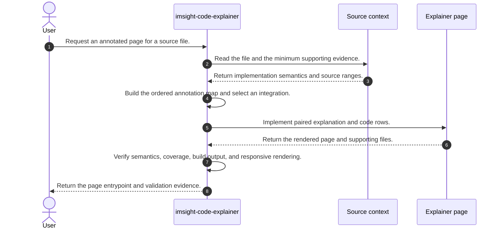
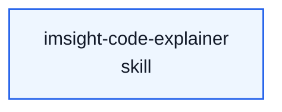

# Imsight Code Explainer Skill Process

## Purpose

This note explains how the standalone `imsight-code-explainer` source skill operates. It aligns its `SKILL.md`, agent metadata, presentation contract, and example HTML asset as one process for turning a source file into an annotated implementation webpage.

The key orchestration rule is: the source file remains authoritative, the annotation map binds prose to contiguous source ranges, and the page is not complete until semantic, structural, and visual checks pass.

## File Inventory

| Relative Path | Category | Resource Owner | Purpose |
| --- | --- | --- | --- |
| `SKILL.md` | Entrypoint | `imsight-code-explainer` | Defines triggers, the seven-stage creation workflow, source-fidelity requirements, output contract, verification, and guardrails. |
| `agents/openai.yaml` | Agent config | `imsight-code-explainer` | Presents the standalone skill in UI surfaces and keeps implicit invocation disabled. |
| `references/presentation-contract.md` | Reference | `imsight-code-explainer` | Specifies paired-row composition, explanation style, source fidelity, visual hierarchy, responsive behavior, accessibility, and rendering checks. |
| `assets/annotated-code-example.html` | Asset | `imsight-code-explainer` | Provides a self-contained example page that demonstrates the intended layout and content semantics without external dependencies. |

## Concepts

- **Source snapshot**: The exact code revision rendered by the explainer, identified by its path and, when available, a revision or content hash.
- **Annotation map**: An ordered set of stable anchors, contiguous source ranges, explanations, and optional equations or shape notes created before UI implementation.
- **Semantic unit**: One contiguous group of source lines that expresses a single teaching idea and becomes one paired page row.
- **Paired row**: A structural layout unit containing an explanation cell and its exact source range under one shared row boundary.
- **Visible elision**: An explicit marker for an omitted source range that preserves original line numbering and explains why the range is absent.
- **Project-native integration**: A page implemented in the web framework, design system, highlighter, math renderer, and build path already in scope.
- **Standalone integration**: A small semantic HTML and CSS deliverable, with JavaScript used only for necessary progressive enhancement.
- **Presentation contract**: The runtime reference that defines how content, code, responsiveness, and accessibility must be composed and verified.
- **Example resource**: The dependency-free HTML asset whose structure can be adapted while its sample content, labels, and palette must be replaced.

## High Level Process



## Skill Call Graph

The source skill exposes no public subcommands and invokes no external skills. Its process is owned by one entrypoint.



There are no runtime call edges to list. The presentation contract and HTML example are passive resources loaded by the entrypoint, not callable nodes.

## Formal Skill Process

```python
from pathlib import Path


@skill(
    name="imsight-code-explainer",
    description="Turn one source file into a verified annotated implementation webpage.",
)
def run_code_explainer(
    user_request: str,
    source_file: Path,
    output_path: Path | None = None,
) -> StageResult:
    if not source_file.is_file():
        return StageResult(
            status="blocked",
            blockers=[f"Source file does not exist: {source_file}"],
            next_action="Provide a readable source-code file.",
        )

    resolved_output = output_path or agent_do(
        "Resolve the existing documentation or web location implied by the repository, falling back to a sibling explainer directory.",
        context={"user_request": user_request, "source_file": source_file},
        returns=Path,
    )

    understanding = agent_do(
        "Explain the complete implementation from the source and the minimum supporting definitions, callers, tests, types, and authoritative references.",
        context={"source_file": source_file, "user_request": user_request},
        returns=dict,
        constraints=["Do not modify the source file.", "Do not guess unsupported behavior, equations, or shapes."],
    )

    annotation_map = agent_do(
        "Partition the source into ordered contiguous semantic units with stable anchors and explanations focused on intent, invariants, data flow, and consequences.",
        context={"source_file": source_file, "understanding": understanding},
        returns=list,
        constraints=["Cover every intended line exactly once or label an explicit elision."],
    )

    integration = agent_select(
        ["project-native", "standalone"],
        criterion="Use the existing web stack when it is in scope, otherwise choose the smallest reliable static implementation.",
        context={"resolved_output": resolved_output, "user_request": user_request},
    )

    page = agent_do(
        "Build the explainer page from the annotation map using structurally paired rows and the presentation contract.",
        context={
            "source_file": source_file,
            "resolved_output": resolved_output,
            "annotation_map": annotation_map,
            "integration": integration,
            "presentation_contract": "references/presentation-contract.md",
            "standalone_example": "assets/annotated-code-example.html",
        },
        returns=StageResult,
    )
    if page.status in {"blocked", "failed"}:
        return page

    verified = agent_check(
        "Are the explanations accurate, source ranges faithful and complete, and desktop and narrow renderings usable without unintended horizontal overflow?",
        context={"source_file": source_file, "annotation_map": annotation_map, "page": page},
        returns=bool,
        rubric="True only when semantic evidence, exact source coverage, relevant project checks, browser rendering, anchors, accessibility, and console behavior have been inspected.",
    )
    if not verified:
        return StageResult(
            status="failed",
            evidence=list(page.evidence),
            blockers=["The explainer did not pass semantic or rendering verification."],
            next_action="Revise the annotation map or page and rerun the failed checks.",
        )

    return StageResult(
        status="ready",
        evidence=[str(resolved_output), "source coverage check", "desktop and narrow rendering checks"],
        changed_refs=list(page.changed_refs),
    )
```

## Skill Process Explanation

- **Resolve input and output.** The entrypoint receives one code file, an optional destination, and audience or technology constraints; it blocks on a missing source and otherwise chooses the repository's natural page location or a standalone sibling directory.
- **Understand the implementation.** The skill reads the complete file plus only the supporting definitions, callers, tests, types, or upstream references needed for accurate explanation; this stage produces the semantic evidence used by every later annotation.
- **Build the annotation map.** The semantic evidence is converted into ordered, contiguous source ranges with stable anchors and one teaching idea per row; complete coverage or visible elisions prevent silent source distortion.
- **Choose integration.** The repository context selects either a project-native page or the minimal standalone path, preserving the user's chosen stack and avoiding unnecessary framework adoption.
- **Implement the page.** The annotation map, presentation contract, and optional HTML example produce the page entrypoint and supporting files while the source file remains unchanged.
- **Verify and deliver.** Source fidelity, semantic claims, build checks, wide and narrow rendering, anchors, accessibility, overflow, and console behavior determine readiness; the final handoff names the page, source snapshot, checks, and any elisions.

## Evidence Handoffs

| Producing skill or stage | Evidence | Consuming stage |
| --- | --- | --- |
| Source and supporting context | Definitions, callers, tests, types, algorithm references, and exact source lines | Implementation understanding |
| Implementation understanding | Verified behavior, invariants, data flow, equations, and shapes | Annotation-map creation |
| Annotation-map creation | Ordered anchors, contiguous ranges, explanations, and visible elisions | Page implementation |
| Presentation contract and example asset | Structural layout, responsive, source-fidelity, accessibility, and styling patterns | Page implementation and browser verification |
| Page implementation | Entrypoint and supporting files | Build and rendering checks |
| Verification | Coverage, project-check, desktop, narrow, accessibility, and console evidence | Final user handoff |

## Validation Notes

- Every source-owned runtime file is included in the inventory and represented in the process explanation.
- The high-level sequence and formal process agree on input resolution, understanding, annotation, integration, implementation, verification, and delivery order.
- The source has no public subcommands, nested command ownership, or external skill calls.
- Durable side effects are limited to the requested explainer page and its supporting files; the source code remains read-only unless separately authorized.
