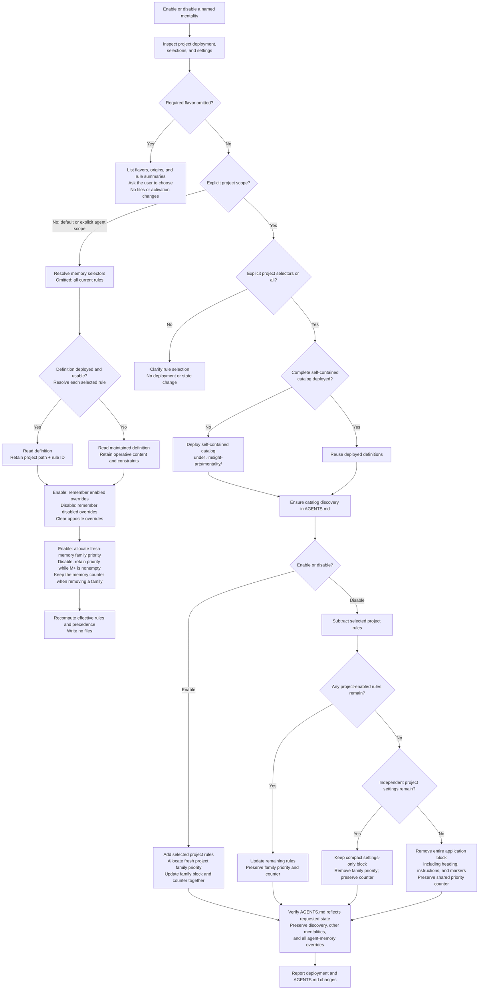

# Mentality Actions

## Workflow

1. Resolve the action, target project, and named mentalities from the caller. For enable/disable, follow **Enable/Disable Decision Tree**, beginning with read-only project inspection.
2. Load each selected child's entrypoint and selector contract, including any required flavor choice. Human Speak without a named flavor returns its chooser before any mutation. Apply scope and rule defaults only after the target is fully selected; validate the complete request before deployment or any selection change.
3. Read [runtime-injection.md](runtime-injection.md) and execute the matching detail section below.
4. Verify the action's file and state boundaries, then report canonical selections, family priorities, and actual effects. Preserve child settings during rule-only actions; include the child's settings in recall.

If the task does not map cleanly to these steps, use the native planning tool to build a bounded plan from the declared actions and caller intent. Omitted enable/disable scope defaults to agent memory; conflicting scope instructions require clarification. Project actions still require explicit selectors.

## Enable/Disable Decision Tree

Use this tree for every registered mentality, including natural requests such as “enable Brooks” and “disable Agile Experimenter.” First inspect the target project's deployed definitions, discovery, project selections, family priorities, allocation counter, and child settings without changing them. Existing project rules or catalog availability never choose the action's scope.

If the named child requires a flavor, resolve it before continuing. Human Speak without an explicit flavor lists available flavors with their origins and rule summaries, then asks for a choice. This remains true with one available flavor or previously selected rules. Keep the pending action in conversation; no deployment or activation change is permitted while the choice is unresolved. In a request covering several mentalities, resolve all required flavors before any mutation.

Unless the caller explicitly requests project-wide application, a project action, or an application change in `AGENTS.md`, route enable/disable to the matching memory action. Unspecified memory selectors expand once to all current canonical rules; specified selectors choose only that subset. An explicit project request requires selectors or `all`; clarify missing project selectors before any deployment or state change. Explicitly conflicting scope instructions also require clarification; omitted scope does not.



Validate the mentality, complete selector set, and scope before either branch changes files or memory. Resolve mixed deployed/undeployed definitions per rule through [Definition Retention](runtime-injection.md#definition-retention); an ID alone is insufficient without its project-bound locator. Memory disable remains an explicit negative override even when project rules are enabled. Both project enable and project disable include [Project application preparation](runtime-injection.md#project-application-preparation), without a separate deployment request or confirmation.

Every project action reconciles `AGENTS.md` with the requested state, including priority allocation when enabling. This includes removing an empty application block and retaining catalog discovery. Non-enabling actions whose resulting contents already match need no physical rewrite. Rule-only actions preserve independent settings such as Ponytail edit scope; “all rules” does not grant destructive edit scope. These defaults do not activate a bare child invocation or change deployment-only, review, or configuration argument semantics.

Apply [family priority assignment](priorities.md#priority-assignment) to each enabling action. A fresh explicit enable raises the selected family's priority even when its IDs already match; it is not a no-op. Disable never renumbers surviving families or decreases either scope's counter. Preserve agent-over-project precedence, then use higher family priority for conflicts within a scope.

### Routing examples

| Request | Resolution |
| --- | --- |
| `enable Brooks` | Enable all current Brooks rules in this agent's memory; no file changes. |
| `disable Brooks r5` | Remember an explicit memory disable for `r5`, even if project-enabled; no file changes. |
| `enable Brooks r1 in project scope` | Ensure complete deployment and discovery, then add `r1` to the project application block. |
| `disable all Brooks rules in AGENTS.md` | Ensure deployment and discovery, then remove the Brooks application block; other mentalities and memory stay unchanged. |
| `enable Brooks in project scope` | Clarify which rules or `all` before any writes; project selectors are not implicit. |
| `enable human-speak` | List flavor origins and summaries and ask for a choice; do not infer Mark-Life Style or enable rules. |
| `enable human-speak mark-life-style` | Enable all current rules of that explicitly named flavor in agent memory. |

## Deploy

**Input:** one or more named mentalities and a target project, including explicit flavors when required. Naming particular principles identifies their owning mentality, but never substitutes for a Human Speak flavor choice. Deployment publishes each selected target's complete catalog; a Human Speak flavor does not publish its siblings.

1. Read the complete maintained catalog and its **Catalog Publication** contract in the child's entrypoint or selected flavor command. Resolve its declared storage key; external reference tables are not publication inputs.
2. Render all canonical principles with maintained definitions, original examples, judgment notes, and applicability into `.imsight-arts/mentality/<mentality>-principles.md`. Follow [External references](runtime-injection.md#external-references): exclude source links, third-party material, and reference tables; create no source directory.
3. Add or refresh only the catalog discovery block in `AGENTS.md`, following **Managed Project Files** in the runtime reference.
4. Verify the complete catalog and discovery reference resolve within the project without network access or an installed skill. Confirm project selection and every agent's remembered overrides are unchanged.

**File effects:** the deployed catalog and the catalog's `AGENTS.md` discovery block only. Deployment never creates a project-enabled selection, even when the caller names all principles. Refreshing a catalog does not enable newly added principles.

**Output:** mentality names, deployed canonical rule index, catalog and discovery paths, and whether catalogs were created or refreshed. State that deployment alone enables no rules.

## Enable Project

**Input:** named mentalities and explicit rule selectors, including `all` within a named mentality. Child intensity configuration is a separate replacement action, not an alias for this union operation.

1. Resolve selectors against each child's complete canonical catalog.
2. Run [Project application preparation](runtime-injection.md#project-application-preparation): deploy missing or incomplete material automatically, reuse complete deployment, and ensure discovery in `AGENTS.md`.
3. Read current project selections, family priorities, and the shared next-priority counter. Union the resolved IDs into each affected set and allocate a fresh priority per family in caller order through [Priority Assignment](priorities.md#priority-assignment).
4. Update the affected project-selection blocks and shared priority counter together in `AGENTS.md`, following the shared write protocol.
5. Verify the resulting project sets and any deployment/discovery changes while preserving complete existing catalogs, unrelated instructions, independent settings, and all memory overrides.

**File effects:** required catalog deployment, catalog discovery, and project-selection blocks in `AGENTS.md`. These rules become project-wide requirements subject to agent-local overrides.

**Output:** newly enabled IDs, unchanged IDs, resulting project selection, old and new family priorities, deployment effects, and changed paths including `AGENTS.md`. When IDs already match, report the priority change from the new enable request. Do not claim that these are every agent's effective rules.

## Disable Project

**Input:** named mentalities and explicit rule selectors.

1. Validate all selectors using the child's canonical catalog before any writes.
2. Run [Project application preparation](runtime-injection.md#project-application-preparation), including automatic deployment and discovery when needed, even if no project rules are currently enabled.
3. Re-read current project selections and subtract the resolved IDs. An absent project selection is empty. Preserve each remaining family's priority and the shared allocation counter; remove the family priority when its project selection becomes empty.
4. Update existing affected project-selection blocks using [Empty project selection](runtime-injection.md#empty-project-selection). When no rules or independent child settings remain, remove the whole application block, including its heading, instructions, and markers. Do this even when an existing block already lists `none`. Preserve independently configured settings in a compact settings-only block. An absent application block stays absent; prerequisite deployment may still create catalog discovery in `AGENTS.md`.
5. Verify any deployment/discovery changes and the resulting project selection. Preserve complete existing catalogs, unrelated project rules, independent settings, and every agent's memory overrides.

**File effects:** required catalog deployment and discovery updates, plus updates or removal of affected project-selection blocks in `AGENTS.md`. Disabling a project rule removes the shared requirement; it does not prohibit an agent from explicitly enabling that rule in memory.

**Output:** removed IDs, unchanged IDs, resulting project selection and family priority or `none`, deployment effects, changed paths, and whether the application block was updated, removed, retained for settings only, or already absent. Report an empty selection in chat; do not leave a disabled family placeholder in `AGENTS.md`. The shared next-priority counter remains available for later enables.

## Enable Memory

**Input:** named mentalities and optional rule selectors. “Enable Brooks” and “remember and apply Brooks r1” select this action unless project scope is explicit. A named memory enable with no selectors selects all currently defined rules of that mentality.

1. Expand omitted selectors to the named child's current canonical IDs, or resolve the explicit subset. Validate the complete selection and read its meanings through [Definition Retention](runtime-injection.md#definition-retention); deployment is not required.
2. Remove each selected ID from this agent's remembered disabled set and add it to its remembered enabled set.
3. Keep the explicit enabled override even when the project already enables the same rule, so later project changes do not erase the caller's local intent. Allocate a fresh memory priority for each requested family through [Priority Assignment](priorities.md#priority-assignment), including when its remembered IDs already match.
4. Recompute effective selection and retain the overrides, family priorities, next-memory-priority counter, and each item's project-reference or inline-content in this agent's chat context only. Preserve independent child settings such as Ponytail edit scope and inherited project priorities.

**File effects:** none, including no catalog deployment, repair, instruction-file update, or session-state file.

**Output:** explicit memory-enabled IDs, remaining memory-disabled IDs, effective selection, and old and new memory family priorities. Follow [Memory Confirmation](runtime-injection.md#memory-confirmation) to summarize the meanings, retention sources, scope, and zero file effects.

## Disable Memory

**Input:** named mentalities and optional rule selectors. “Disable Brooks” and “do not apply Brooks r5 in your memory” select this action unless project scope is explicit. A named memory disable without selectors disables all currently defined rules of that mentality.

1. Expand omitted selectors or resolve the explicit subset, then validate the complete selection and read its meanings through [Definition Retention](runtime-injection.md#definition-retention); deployment is not required.
2. Remove each selected ID from this agent's remembered enabled set and add it to its remembered disabled set.
3. Retain that disabled override even if the project currently leaves the rule disabled; it must also mask a later project enable.
4. Recompute effective selection and retain each override with its definition reference or content. Preserve the family priority while its `M+` is nonempty; otherwise remove its memory priority while retaining `M-` and the next-memory-priority counter. Do not change child settings, project files, inherited project priorities, or another agent's context.

**File effects:** none. Disabling is an explicit negative override, not a request to inherit project defaults.

**Output:** explicit memory-disabled IDs, remaining memory-enabled IDs, and effective selection, with the same [Memory Confirmation](runtime-injection.md#memory-confirmation). Explain which guidance is suppressed, including when it was already disabled in project scope.

## Recall

**Input:** an optional mentality filter and optional task context, with an explicit flavor for Human Speak. Without a filter, report ordinary registered mentalities and present the Human Speak flavor chooser; do not infer its flavor from existing state. Once a flavor is named, report its rules and provenance. Report unresolved identifiers separately.

1. Read current project selections and family priorities from `AGENTS.md` and this agent's explicit remembered overrides and priorities from its own context. Validate priority state through [priorities.md](priorities.md) without repairing it.
2. Resolve the effective selection using the shared per-rule precedence. Keep principle identity qualified by mentality when reporting across children.
3. Evaluate task applicability and material conflicts through [composition.md](composition.md). When no substantive task is available, report applicability as not evaluated rather than treating the recall request as the task being guided.
4. Report project-enabled rules, memory-enabled rules, memory-disabled rules, each scoped family's priority, effective selection, and the applicable rules for the supplied task. Name the source and family priority of each effective rule and explain masked or conflicting guidance, including the winning scope or higher number. For Ponytail, use its [recall extension](../subskills/ponytail/references/state.md#recall) to include both axes and their provenance.
5. Identify missing or inconsistent state/catalog evidence without repairing files or fabricating remembered selections.

**File effects:** none. Recall changes no selections or configured values; reading or recovering definition references/content follows the shared retention contract.

**Output:** identify family, canonical ID, name, project setting and priority, memory override (`enabled`, `disabled`, or `inherit`) and priority, and effective setting with its source. Include practical meanings and definition references or inline-content through [Memory Confirmation](runtime-injection.md#memory-confirmation); use a table only when it aids comparison. List applicable IDs separately when task context is known; otherwise label the result as configured selection. Show `none` explicitly for empty sets, and distinguish missing remembered context or priority from a confirmed empty set.

### Example interaction

This user/AI exchange is illustrative. Learn its intent, scope semantics, and response shape; do not hardcode its IDs or wording.

Given project-enabled Brooks `r1` and `r5` at project priority `0`, and this agent's remembered enabled `t2` at memory priority `2` and disabled `r5`:

```text
User: Recall the effective Imsight mentality for these test-only assertion changes.
Agent:
Brooks
Project enabled: r1, r5
Project family priority: 0
Memory enabled: t2
Memory family priority: 2
Memory disabled: r5
Effective selection: r1 (project, priority 0), t2 (memory, priority 2)
Applicable to these test-only changes: t2
Not applicable here: r1 (production guidance)
Suppressed: r5, because the agent-memory disable overrides project enable.
Definitions: project-reference to .imsight-arts/mentality/brooks-principles.md
in this project, entries r1, r5, t2.
Meaning: r1 makes code structure understandable; r5 keeps dependencies
pointing toward stable policy; t2 checks behavior without tying tests to internals.
Docs Writer
Project enabled: none
Project family priority: none
Memory enabled: none
Memory family priority: none
Memory disabled: none
Effective selection: none
No files written.
```

## Guardrails

- DO NOT partially apply a multi-selector request containing invalid or ambiguous selectors.
- DO NOT start any requested mutation while a required flavor choice is unresolved.
- DO NOT deploy or repair catalogs as a side effect of a memory action or recall.
- DO NOT enable rules merely because their catalog was deployed.
- DO NOT rewrite project selections during an agent-memory action.
- DO NOT describe an explicit memory disable as returning to project inheritance.
- DO NOT report selected rules as currently applicable without considering the task.
