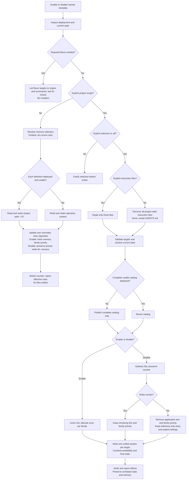

# Mentality Actions

## Workflow

1. Resolve project, action, named families/flavors, scope, and selectors. Inspect current state without changing it.
2. Validate the whole request before effects. Missing flavors use the selected child's chooser; invalid or ambiguous selectors reject the request, not just the invalid subset.
3. Read the matching action below and only needed [runtime](runtime-injection.md) sections. For writes, resolve [instruction-file targets](runtime-injection.md#instruction-file-selection).
4. Execute and report canonical IDs, scope, priorities, settings, changed paths, and any partial effects. Preserve unrelated state.

For other requests, use the native planning tool with the declared action boundaries.

## Enable/Disable Decision Tree

Inspect deployment first; its presence never determines scope. Omitted enable/disable scope means agent memory, and omitted memory selectors expand once to all current rules. Project actions require explicit selectors or `all`. Naming a coding-agent instruction file (`AGENTS.md`, `CLAUDE.md`, etc.) selects project scope. Resolve conflicting scope instructions before mutation.

Both project branches automatically publish missing catalogs, then write final guidance once. A fresh enable reprioritizes its family even if IDs match; disable never compacts priority gaps. Rule-only actions preserve child settings, so `all` does not grant destructive edit scope.

| Request | Resolution |
| --- | --- |
| `enable Brooks` | All current Brooks IDs in this agent's memory; no files. |
| `disable Brooks r5` | Explicit memory suppression, including future project enables. |
| `enable Brooks r1 in project scope` | Publish if needed; update every discovered project-wide instruction file. |
| `enable Brooks in project scope` | Ask for selectors or `all` before writes. |
| `disable all Brooks rules in CLAUDE.md` | Publish if needed; make Brooks reference-only in that file alone. |
| `enable human-speak` | List flavors with origins/summaries and ask; no mutation. |
| `enable human-speak han-style` | All current Han Style rules in agent memory. |
| `enable rigor-control` | List assurance flavors and summaries and ask; no mutation. |
| `enable rigor-control product-showcase` | All current Product Showcase rules in agent memory. |

## Deploy

Input: named mentalities, required flavors, target project, and optional instruction-file selection. Rule names identify their family; publication always includes its complete catalog.

1. Resolve targets and current state. Read each child's **Catalog Publication** contract and declared storage key.
2. Publish complete catalogs through [Catalog artifact](runtime-injection.md#catalog-artifact), excluding upstream material and reference tables.
3. Recompose the [unified section](runtime-injection.md#unified-mentality-section): combine the catalog link with an existing selection, or add a minimal reference-only entry. Consolidate older owned blocks when needed; preserve activation, settings, counters, and memory.
4. Verify self-containment and links. Leave already-correct instruction text unchanged when only the catalog needs refresh.

Effects: catalogs and availability references only. Report created/refreshed/reorganized/unchanged paths and the canonical index. Deployment enables nothing, including newly added catalog rules.

## Enable Project

Input: named families and explicit selectors or `all`. This adds rules; child intensity configuration is a separate replacement operation.

1. Validate selectors and run [Project application preparation](runtime-injection.md#project-application-preparation), which publishes required catalogs without an intermediate discovery write.
2. Union selected IDs into each affected project set. Allocate one fresh [priority](priorities.md#priority-assignment) per family in caller order, even if IDs already match.
3. Rewrite each target's unified section with final IDs/names, priority, settings, catalog link, and counter. Follow [Write protocol](runtime-injection.md#write-protocol); consult [examples](instruction-examples.md) only when useful.
4. Verify state and preserved unrelated content. Report added/unchanged IDs, resulting selection, old/new priorities, settings, and file effects. These are project defaults, not every agent's effective rules.

## Disable Project

Input: named families and explicit selectors.

1. Validate and prepare as for project enable, including required catalog publication even when no rules are active.
2. Subtract IDs from resolved project selections. Missing mirrors do not cancel existing selections. Keep remaining family priorities and the known counter; remove an emptied family's priority.
3. Rewrite every target: keep remaining rules or reduce the family to a reference-only entry under [Empty project selection](runtime-injection.md#empty-project-selection). Preserve explicit settings; remove obsolete application text rather than appending disabled flags.
4. If all families are inactive, shorten shared prose to availability/selective reading. Verify and report removed/unchanged IDs, resulting priority or `none`, settings, and file effects.

Removing a project requirement still permits explicit memory activation. Disable allocates nothing and retains sequence history.

## Enable Memory

Input: named families and optional selectors. Omission means all current canonical IDs, not future additions.

1. Resolve selectors and meanings through [Definition Retention](runtime-injection.md#definition-retention); deployment is unnecessary.
2. Remove selected IDs from `M-` and add them to `M+`, even if project state already matches.
3. Allocate fresh memory family priorities in caller order; recompute effective selection and retain definitions, overrides, priorities, counter, and settings in this agent's context only.
4. Use [Memory Confirmation](runtime-injection.md#memory-confirmation): report meanings, retention sources, effective result, priority changes, and zero file effects.

## Disable Memory

Input and retention match memory enable.

1. Resolve selectors and meanings; remove selected IDs from `M+` and add them to `M-`.
2. Preserve explicit suppression even when the project currently disables the rule. This is not a return to inheritance.
3. Keep the family's priority while `M+` remains; otherwise remove it while retaining `M-` and the counter. Preserve settings, project state, and other agents' memory.
4. Confirm meanings, suppressed guidance, effective result, and zero file effects as above.

## Recall

Input: optional mentality filter and task context; Human Speak and Rigor Control always need an explicit flavor. Without a filter, report ordinary children and show both choosers.

1. Read applicable instruction-file state and this agent's context, preserving provenance and deduplicating matching entries. Validate [priorities](priorities.md) without repair; report unresolved differences or unavailable memory.
2. Resolve effective selection and [task applicability/conflicts](composition.md). With no substantive task, mark applicability not evaluated.
3. Report family-qualified IDs/names; project, memory-enabled and memory-disabled sets; scoped priorities; effective settings and sources; and applicable/excluded rules. Explain masks and conflicts with the winning scope or priority.
4. Include meanings and retained definitions through **Memory Confirmation**. Add [Ponytail's axes](../subskills/ponytail/references/state.md#recall) when selected. Distinguish confirmed empty, unknown, and unavailable state.

No files, selections, settings, or counters change. Example: project Brooks `r1,r5` at priority `0`, memory-enabled `t2` at priority `2`, and memory-disabled `r5` yields `r1` from project and `t2` from memory; `r5` is suppressed. A test-only task may apply only `t2`.

## Guardrails

- DO NOT mutate any part of an invalid multi-selector request or pending flavor choice.
- DO NOT deploy or repair files during memory actions or recall.
- DO NOT equate deployment with activation, memory disable with inheritance, or selection with applicability.
